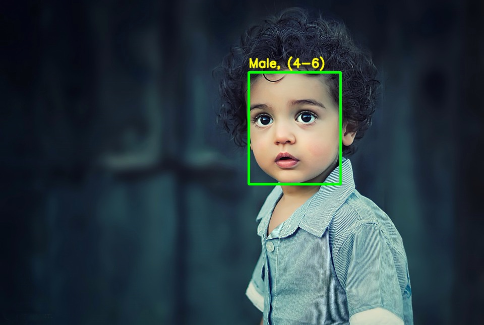

# Gender Age Detection

We use Deep Learning to accurately identify the gender and age of a person from a single image of a face. The predicted gender may be one of ‘Male’ and ‘Female’, and the predicted age may be one of the following ranges- (0 – 2), (4 – 6), (8 – 12), (15 – 20), (25 – 32), (38 – 43), (48 – 53), (60 – 100) (8 nodes in the final softmax layer). It is very difficult to accurately guess an exact age from a single image because of factors like makeup, lighting, obstructions, and facial expressions. And so, we make this a classification problem instead of making it one of regression.

The convolutional neural network used here has 3 convolutional layers:

* Convolutional layer; 96 nodes, kernel size 7
* Convolutional layer; 256 nodes, kernel size 5
* Convolutional layer; 384 nodes, kernel size 3

The model has been trained on the Adience dataset and it is available [here](https://www.kaggle.com/ttungl/adience-benchmark-gender-and-age-classification). This dataset serves as a benchmark for face photos and is inclusive of various real-world imaging conditions like noise, lighting, pose, and appearance.

## Prerequisites
You’ll need to install OpenCV (cv2) to be able to run this project. You can do this with pip -
```bash
pip install opencv-python
```
Other packages you’ll be needing are math and argparse, but those come as part of the standard Python library.

## Usage
```bash
git clone https://github.com/nabagata/gender-age-detection.git 
```
python gad.py --image images/kid1.jpg

## Results


